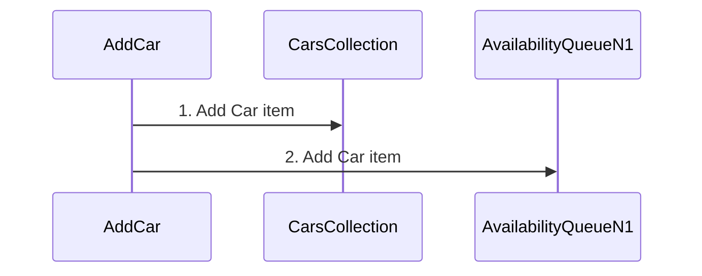
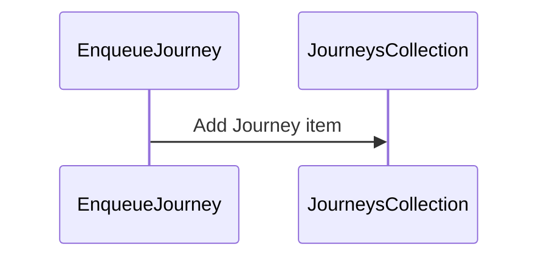
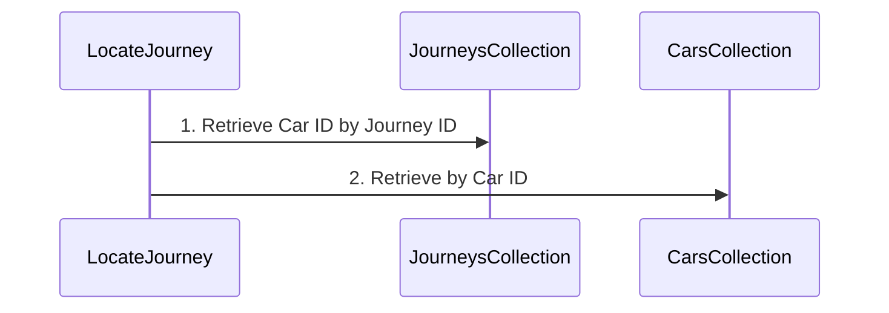
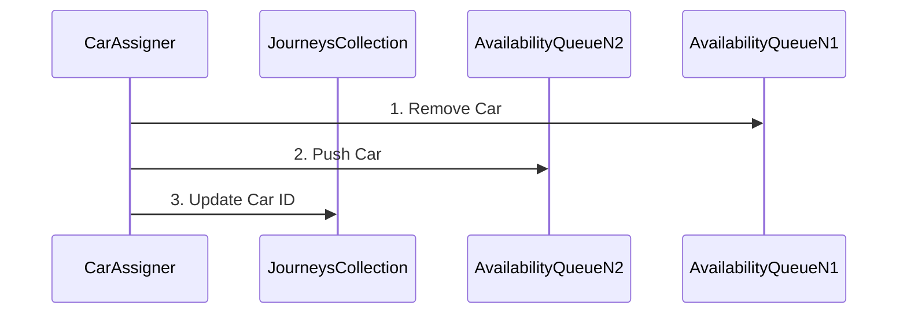
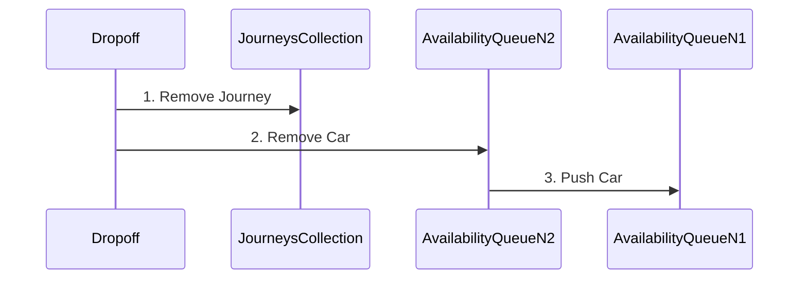

# Index
1. [Getting Started](#getting-started)
2. [Car Pool Challenge](#car-pooling-service-challenge)
3. [Proposed Solution](#proposed-solution-and-decision-documentation)


# Getting Started [↑](#index)

This guide will help you set up your development environment, build, and run the Go application. It includes instructions for live reloading with Air and creating binaries for multi-platform support.

## Prerequisites

Ensure you have the following installed:

- Go programming language
- Docker for building and running containerized applications
- Air for live reloading in development (optional). See https://github.com/cosmtrek/air

## Development Setup
### Setting Up Live Reloading with Air

Install "Air" to facilitate live reloading during development:

```shell
go get -u github.com/cosmtrek/air
```

Initialize Air configuration:


```shell
$(go env GOPATH)/bin/air init
```

Modify the `.air.toml` configuration file with the following settings to exclude certain directories and set the command to build the application:

```toml
cmd = "go build -o ./tmp/main ./cmd/main.go"
exclude_dir = ["assets", "tmp", "vendor", "testdata", "bin"]
```

To start the application with live reloading, run:

```shell
$(go env GOPATH)/bin/air
```

## Building the Application
### Creating a Binary for Alpine Linux on Mac

To create a binary that is compatible with Alpine Linux (useful for Docker containers), execute the following command in your terminal:

```shell
CGO_ENABLED=0 GOOS=linux GOARCH=amd64 go build -o bin/car-pooling-challenge cmd/main.go
```

### Building the Docker Image
**Understanding the Dockerfile**

The Dockerfile is used to define the steps necessary to create a Docker image for your application. It consists of several commands:

    FROM: Specifies the base image from which you are building.
    RUN: Executes a command in the container.
    COPY: Copies files or directories from your host to the container.
    EXPOSE: Informs Docker that the container listens on the specified network ports at runtime.
    ENTRYPOINT: Specifies the default executable for the container.

**Docker Build Commands**

After creating the binary, you can build the Docker image with:

```shell
docker build -t car-pooling-challenge:latest .
```
For multi-platform environments (e.g., when you're working on a Mac M1 chip but deploying to an amd64 architecture), use Docker Buildx:

```shell
docker buildx build --platform linux/amd64,linux/arm64 -t car-pooling-challenge:latest .
```

## Running the Application

Run the Docker container with the following command to start the application:

```shell
docker run --name car-pooling-challenge -p 9091:9091 car-pooling-challenge:latest
```

This command runs the container and maps the container's port 9091 to port 9091 on the host, allowing you to access the application via localhost:9091.

# Car Pooling Service Challenge [↑](#index)

Design/implement a system to manage car pooling.

At Cabify we provide the service of taking people from point A to point B.
So far we have done it without sharing cars with multiple groups of people.
This is an opportunity to optimize the use of resources by introducing car
pooling.

You have been assigned to build the car availability service that will be used
to track the available seats in cars.

Cars have a different amount of seats available, they can accommodate groups of
up to 4, 5 or 6 people.

People requests cars in groups of 1 to 6. People in the same group want to ride
on the same car. You can take any group at any car that has enough empty seats
for them. If it's not possible to accommodate them, they're willing to wait until 
there's a car available for them. Once a car is available for a group
that is waiting, they should ride. 

Once they get a car assigned, they will journey until the drop off, you cannot
ask them to take another car (i.e. you cannot swap them to another car to
make space for another group).

In terms of fairness of trip order: groups should be served as fast as possible,
but the arrival order should be kept when possible.
If group B arrives later than group A, it can only be served before group A
if no car can serve group A.

For example: a group of 6 is waiting for a car and there are 4 empty seats at
a car for 6; if a group of 2 requests a car you may take them in the car.
This may mean that the group of 6 waits a long time,
possibly until they become frustrated and leave.

## Evaluation rules

This challenge has a partially automated scoring system. This means that before
it is seen by the evaluators, it needs to pass a series of automated checks
and scoring.

### Checks

All checks need to pass in order for the challenge to be reviewed.

- The `acceptance` test step in the `.gitlab-ci.yml` must pass in master before you
submit your solution. We will not accept any solutions that do not pass or omit
this step. This is a public check that can be used to assert that other tests 
will run successfully on your solution. **This step needs to run without 
modification**
- _"further tests"_ will be used to prove that the solution works correctly. 
These are not visible to you as a candidate and will be run once you submit 
the solution

### Scoring

There is a number of scoring systems being run on your solution after it is 
submitted. It is ok if these do not pass, but they add information for the
reviewers.

## API

To simplify the challenge and remove language restrictions, this service must
provide a REST API which will be used to interact with it.

This API must comply with the following contract:

### GET /status

Indicate the service has started up correctly and is ready to accept requests.

Responses:

* **200 OK** When the service is ready to receive requests.

### PUT /cars

Load the list of available cars in the service and remove all previous data
(reset the application state). This method may be called more than once during
the life cycle of the service.

**Body** _required_ The list of cars to load.

**Content Type** `application/json`

Sample:

```json
[
  {
    "id": 1,
    "seats": 4
  },
  {
    "id": 2,
    "seats": 6
  }
]
```

Responses:

* **200 OK** When the list is registered correctly.
* **400 Bad Request** When there is a failure in the request format, expected
  headers, or the payload can't be unmarshalled.

### POST /journey

A group of people requests to perform a journey.

**Body** _required_ The group of people that wants to perform the journey

**Content Type** `application/json`

Sample:

```json
{
  "id": 1,
  "people": 4
}
```

Responses:

* **200 OK** or **202 Accepted** When the group is registered correctly
* **400 Bad Request** When there is a failure in the request format or the
  payload can't be unmarshalled.

### POST /dropoff

A group of people requests to be dropped off. Whether they traveled or not.

**Body** _required_ A form with the group ID, such that `ID=X`

**Content Type** `application/x-www-form-urlencoded`

Responses:

* **200 OK** or **204 No Content** When the group is unregistered correctly.
* **404 Not Found** When the group is not to be found.
* **400 Bad Request** When there is a failure in the request format or the
  payload can't be unmarshalled.

### POST /locate

Given a group ID such that `ID=X`, return the car the group is traveling
with, or no car if they are still waiting to be served.

**Body** _required_ A url encoded form with the group ID such that `ID=X`

**Content Type** `application/x-www-form-urlencoded`

**Accept** `application/json`

Responses:

* **200 OK** With the car as the payload when the group is assigned to a car. See below for the expected car representation 
```json
  {
    "id": 1,
    "seats": 4
  }
```

* **204 No Content** When the group is waiting to be assigned to a car.
* **404 Not Found** When the group is not to be found.
* **400 Bad Request** When there is a failure in the request format or the
  payload can't be unmarshalled.

## Tooling

At Cabify, we use Gitlab and Gitlab CI for our backend development work. 
In this repo you may find a [.gitlab-ci.yml](./.gitlab-ci.yml) file which
contains some tooling that would simplify the setup and testing of the
deliverable. This testing can be enabled by simply uncommenting the final
acceptance stage. Note that the image build should be reproducible within
the CI environment.

Additionally, you will find a basic Dockerfile which you could use a
baseline, be sure to modify it as much as needed, but keep the exposed port
as is to simplify the testing.

:warning: Avoid dependencies and tools that would require changes to the 
`acceptance` step of [.gitlab-ci.yml](./.gitlab-ci.yml), such as 
`docker-compose`

:warning: The challenge needs to be self-contained so we can evaluate it. 
If the language you are using has limitations that block you from solving this 
challenge without using a database, please document your reasoning in the 
readme and use an embedded one such as sqlite.

You are free to use whatever programming language you deem is best to solve the
problem but please bear in mind we want to see your best!

You can ignore the Gitlab warning "Cabify Challenge has exceeded its pipeline 
minutes quota," it will not affect your test or the ability to run pipelines on
Gitlab.

## Requirements

- The service should be as efficient as possible.
  It should be able to work reasonably well with at least $`10^4`$ / $`10^5`$ cars / waiting groups.
  Explain how you did achieve this requirement.
- You are free to modify the repository as much as necessary to include or remove
  dependencies, subject to tooling limitations above.
- Document your decisions using MRs or in this very README adding sections to it,
  the same way you would be generating documentation for any other deliverable.
  We want to see how you operate in a quasi real work environment.

## Feedback

In Cabify, we really appreciate your interest and your time. We are highly 
interested on improving our Challenge and the way we evaluate our candidates. 
Hence, we would like to beg five more minutes of your time to fill the 
following survey:

- https://forms.gle/EzPeURspTCLG1q9T7

Your participation is really important. Thanks for your contribution!

# Proposed solution and decision documentation [↑](#index)

# Key Architectural Decisions
This car pooling is designed to efficiently manage and assign cars to groups of people, taking as priorities the separation of concern, a focus on scalability and maintainability and simplicity of code. Patterns like CQRS, Ports and Adapters makes easy to follow the principles of clean architecture architecture.


## CQRS and Ports/Adapters
Both are well known patterns that make easy to understand and maintain codebases in the long time. This approach enhances performance and scalability, ensuring clarity in functionality and single responsibility in each component and allows to grow separately as the project needs evolve.

## Repositories
The use of repository interfaces abstracts the data storage mechanism, providing flexibility and simplifying data access. This pattern enhances testability and maintainability, allowing for easy mocking of data storage in tests and encapsulating data access logic.

## Minimal External Dependencies
As a project requirement, it is assumed that besides reducing dependencies on third parties. External dependencies may be always analysed and added only in case where they provide real value to development, balancing performance, community suuport, ease of use and coupling.

## Foundation for Future Architectural Patterns:
While the current implementation is straightforward, it writes the path for adopting more complex architectural patterns like event-driven or reactive architectures.

In such architectures, the car assignment process could be triggered by events (e.g., a new journey request or a car becoming available), further optimizing resource usage and responsiveness.

# App flow

## Car Assignment logic

### Assumptions: Business Invariants
1.  **Vehicle Capacity:** Cars have a defined number of available seats that vary (4, 5, or 6 seats).
2.  **Group Size:** Groups of people can range from 1 to 6 individuals.
3.  **Grouping in Vehicles:** People in the same group must travel together in the same vehicle.
4.  **Car Assignment:** A group can only be assigned to a vehicle if there are enough empty seats available for the entire group.
5. **Car Sharing** A group may share the one car with other group if there are available seats on it.
6.  **No Car Reassignment:** Once a group has been assigned to a vehicle and has begun their journey, they cannot be transferred to another vehicle.
7.  **Order of Arrival:** Groups should be served as quickly as possible, maintaining the order of arrival when feasible.

### Independent process
Car assignment is managed by a dedicated coroutine, `CarAssignerHandler`, which operates independently of the main request-handling logic.

**Scalability and Isolation:** The coroutine operates independently of the main request-handling logic, which means that the car assignment process does not directly impact the responsiveness of the user-facing API.

This isolation makes it easier to scale different parts of the system independently. For instance, if the assignment logic becomes a bottleneck, we can opt to a different infrastructure where it can be moved to a separate service or pod,  without major changes to the rest of the system.

**Controlled Throttling and Efficiency:**  
By running the logic in a separate process, you gain control over how frequently the system checks for and assigns cars to waiting journeys. This throttling mechanism allows for balancing between responsiveness and resource utilization.

It avoids the overhead and potential performance bottlenecks of triggering assignments on every incoming request, which can be particularly beneficial under high load.

**Concurrency and In-Memory Data Storage**  
In-memory repositories are used for data storage, aligning with the requirement to avoid external databases. This choice simplifies the architecture and is suitable for scenarios where persistence across restarts is not a primary concern.

Concurrency is managed using mutexes (`sync.Mutex`) in repository implementations. This ensures thread-safe operations and maintains data integrity in a multi-threaded environment. This repository pattern allow to easily swap to another systems.


### Flow process
**AddCar:**

1. Add car items to CarsCollection.
2. Push car to AvailabilityQueueN.



**EnqueueJourney:**

1. Add Journey item to JourneysCollection Heap ordered by WaitingSince Attribute.


**LocateJourney:**

1. Search Journey in JourneysCollection O(1) to retrieve CarID.
2. Search Car in CarsCollection O(1).


**AssignCarJourney:**

1. Search Car in AvailabilityQueueN where N is the number of people in the group.
2. Pop the first Car with enough space from AvailabilityQueueN.
3. Push Car into the AvailabilityQueueN with new available seats.
4. Update carID attribute in Journey O(1).


**Dropoff/Dequeue Journey:**

1. Remove Journey from JourneysCollection O(1).
2. Pop Car item from AvailabilityQueueN.
3. Push Car to AvailabilityQueueN.


### Data Structures Benefits
Three main storages are created:
- **CarRepository**  
  **Structure Type**: Map  
  Direct mapping through IDs so we get 0(1) access complexity facilitating data retrieval and manipulation.
- **JourneyRepository**  
  **Structure Type**: Heap  
  Heap structure maintains journeys ordered by `WaitingSince` attribute, so **F**irst groups **I**n are **F**irst groups **O**ut  
  Not as fast as a regular Priority Queue allows as removing any element from the storage whatever its position with O(log n) efficient for a frequently updated collection.
- **Queues (AvailabilityQueues)**  
  **Structure Type**: Array of Maps  
  Each queue corresponds to a specific car capacity (e.g., 4 seats avail, 5 seats avail), allowing efficient matching of cars to journey groups based on size.  
  Direct mapping O(1), allows easy and fast access to elements to be updated or moved from one queues to other avoiding iteration through a full set of Cars and checking their capacity one by one on each assignment.  
  As there are no business requirements with an special order different from assign available seats, this structure do not need to maintain an strict order.  
  This structure choice aligns business requirements and can be easily extended or reduced with more or less queues or even make them dynamic.

## OpenApi Specs <a id="openapi-specs" name="openapi-specs"></a>

[Link to OpenAPI specification](./api/openapi/car-pooling-service.yaml)

## WIP: Installation guide (not part of final documentation)
To make the development process easier, I have installed "Air". You can start the application by running the command **"$(go env GOPATH)/bin/air"** after executing "air init" and modifying ".air.toml" with the following lines:

```toml
cmd = "go build -o ./tmp/main ./cmd/main.go"
exclude_dir = ["assets", "tmp", "vendor", "testdata", "bin"]
```

To create a binary for Linux Alpine in Mac, execute the following command:

```bash
CGO_ENABLED=0 GOOS=linux GOARCH=amd64 go build -o bin/car-pooling-challenge cmd/main.go
```

After creating the binary, build the Docker image using the following command:

```bash
docker build -t car-pooling-challenge:latest .
```

Finally, run the Docker container using the following command:

```bash
docker run -p 9091:9091 car-pooling-challenge:latest
```
